# ゲーム画像素材

提供された `assets.zip` の画像157点を、元のファイル名・画像データのまま収録しています。

- `images/`: 背景3点（牛舎・誕生・出荷）
- `sprites/`: 牛、人物、設備、道具、タイル、UI、日記イラストなど154点
- `sprites/pack_ruby_sapphire_manifest.json`: ZIPに含まれていた素材情報
- `catalog.json`: 全画像のサイズ・容量・SHA-256・Git blob ID

ゲームからは `assets/sprites/cow_newborn.png` などの相対パスで参照できます。ピクセルアートを拡大するときは、CSSの `image-rendering: pixelated` を使用してください。

## 素材一覧

| プレビュー | ファイル | 名前 | サイズ（px） |
| --- | --- | --- | --- |
| 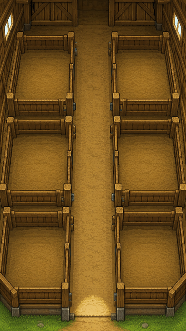 | [barn_bg.png](images/barn_bg.png) | barn_bg | 375 × 666 |
| 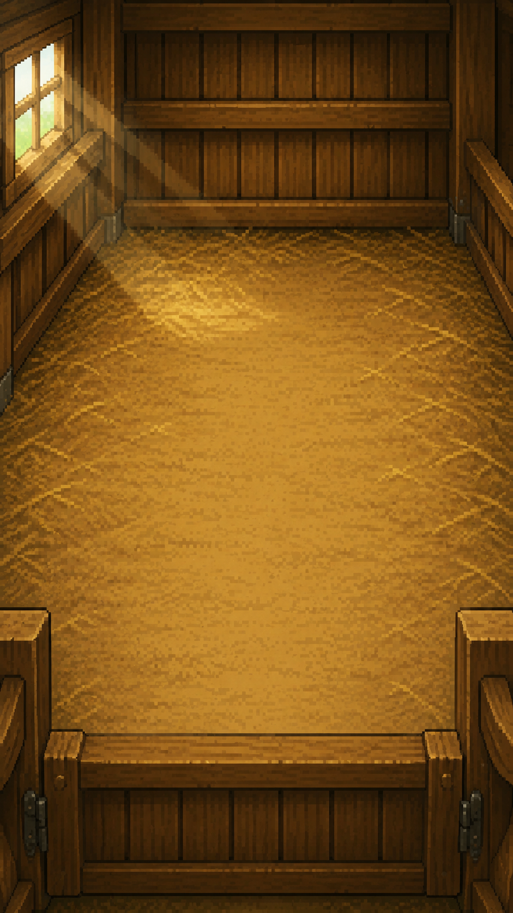 | [birth_bg.png](images/birth_bg.png) | birth_bg | 941 × 1672 |
| 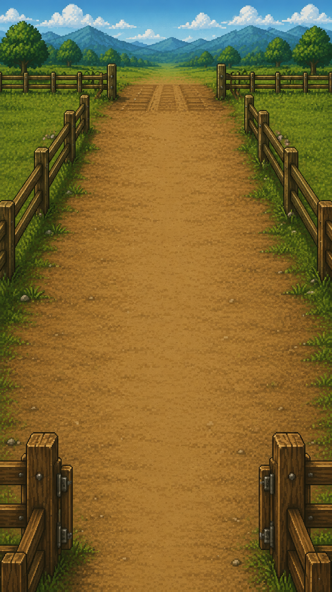 | [shukka_bg.png](images/shukka_bg.png) | shukka_bg | 941 × 1672 |
| 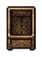 | [auto_feeder.png](sprites/auto_feeder.png) | 自動給餌機 | 53 × 72 |
|  | [auto_waterer.png](sprites/auto_waterer.png) | 自動給水器 | 52 × 58 |
|  | [beehive.png](sprites/beehive.png) | 養蜂箱 | 56 × 60 |
| 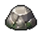 | [big_rock.png](sprites/big_rock.png) | 大きな岩 | 61 × 53 |
| 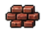 | [brick_pile.png](sprites/brick_pile.png) | レンガの山 | 64 × 48 |
| 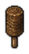 | [brush.png](sprites/brush.png) | ブラシ | 42 × 77 |
| 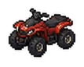 | [buggy.png](sprites/buggy.png) | buggy | 107 × 86 |
|  | [char_down.png](sprites/char_down.png) | char_down | 61 × 85 |
| 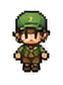 | [char_left.png](sprites/char_left.png) | char_left | 63 × 85 |
|  | [char_right.png](sprites/char_right.png) | char_right | 60 × 85 |
| 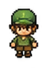 | [char_up.png](sprites/char_up.png) | char_up | 59 × 85 |
| 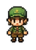 | [char_walk_down.png](sprites/char_walk_down.png) | char_walk_down | 61 × 85 |
|  | [char_walk_left.png](sprites/char_walk_left.png) | char_walk_left | 62 × 85 |
| 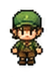 | [char_walk_right.png](sprites/char_walk_right.png) | char_walk_right | 60 × 85 |
|  | [chicken_coop.png](sprites/chicken_coop.png) | 鶏小屋 | 69 × 80 |
| 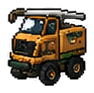 | [combine_harvester.png](sprites/combine_harvester.png) | コンバイン | 94 × 93 |
| 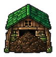 | [compost_shed.png](sprites/compost_shed.png) | 堆肥小屋 | 111 × 112 |
| 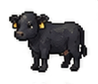 | [cow_10m.png](sprites/cow_10m.png) | cow_10m | 110 × 94 |
| 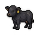 | [cow_2m.png](sprites/cow_2m.png) | cow_2m | 83 × 73 |
| 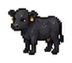 | [cow_4m.png](sprites/cow_4m.png) | cow_4m | 91 × 80 |
| 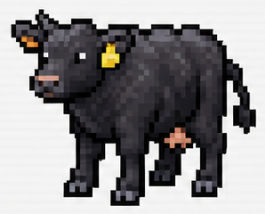 | [cow_mother_base.png](sprites/cow_mother_base.png) | cow_mother_base | 298 × 240 |
| 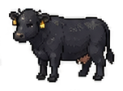 | [cow_mother.png](sprites/cow_mother.png) | cow_mother | 152 × 113 |
| 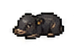 | [cow_newborn.png](sprites/cow_newborn.png) | cow_newborn | 75 × 52 |
|  | [cursor.png](sprites/cursor.png) | cursor | 55 × 68 |
| 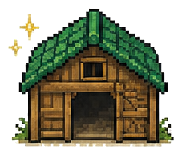 | [diary_barn.png](sprites/diary_barn.png) | diary_barn | 227 × 193 |
|  | [diary_book.png](sprites/diary_book.png) | diary_book | 204 × 160 |
| 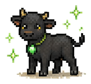 | [diary_calf.png](sprites/diary_calf.png) | diary_calf | 185 × 170 |
|  | [diary_clover.png](sprites/diary_clover.png) | diary_clover | 166 × 167 |
| 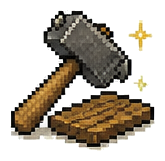 | [diary_construction.png](sprites/diary_construction.png) | diary_construction | 165 × 161 |
| 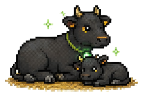 | [diary_cow_calf_rest.png](sprites/diary_cow_calf_rest.png) | diary_cow_calf_rest | 291 × 198 |
| 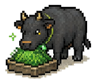 | [diary_cow_eating.png](sprites/diary_cow_eating.png) | diary_cow_eating | 195 × 172 |
| 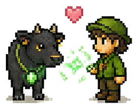 | [diary_cow_farmer.png](sprites/diary_cow_farmer.png) | diary_cow_farmer | 236 × 187 |
| 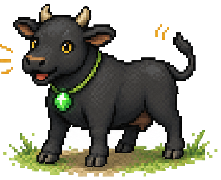 | [diary_cow_healed.png](sprites/diary_cow_healed.png) | diary_cow_healed | 221 × 180 |
| 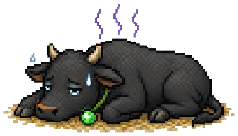 | [diary_cow_sick.png](sprites/diary_cow_sick.png) | diary_cow_sick | 238 × 136 |
| 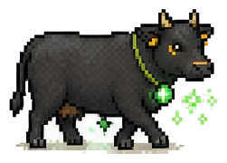 | [diary_cow_walk.png](sprites/diary_cow_walk.png) | diary_cow_walk | 251 × 180 |
| 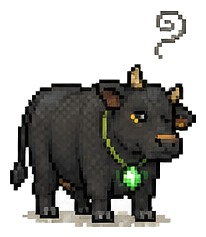 | [diary_cows_question.png](sprites/diary_cows_question.png) | diary_cows_question | 206 × 237 |
| 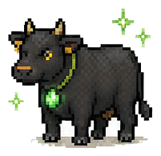 | [diary_cows_sparkle.png](sprites/diary_cows_sparkle.png) | diary_cows_sparkle | 201 × 195 |
| 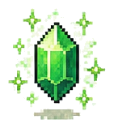 | [diary_crystal.png](sprites/diary_crystal.png) | diary_crystal | 141 × 158 |
|  | [diary_fence.png](sprites/diary_fence.png) | diary_fence | 191 × 131 |
|  | [diary_gift.png](sprites/diary_gift.png) | diary_gift | 162 × 140 |
| 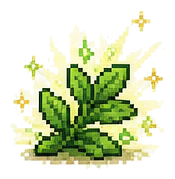 | [diary_grass_shine.png](sprites/diary_grass_shine.png) | diary_grass_shine | 175 × 179 |
| 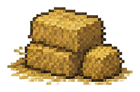 | [diary_hay_bales.png](sprites/diary_hay_bales.png) | diary_hay_bales | 203 × 134 |
| 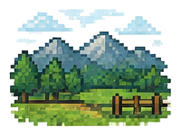 | [diary_landscape.png](sprites/diary_landscape.png) | diary_landscape | 200 × 151 |
| 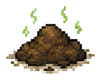 | [diary_manure.png](sprites/diary_manure.png) | diary_manure | 167 × 133 |
| 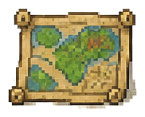 | [diary_map.png](sprites/diary_map.png) | diary_map | 182 × 147 |
| 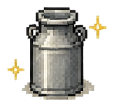 | [diary_milk_can.png](sprites/diary_milk_can.png) | diary_milk_can | 163 × 153 |
|  | [diary_money.png](sprites/diary_money.png) | diary_money | 212 × 169 |
| 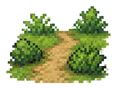 | [diary_path.png](sprites/diary_path.png) | diary_path | 198 × 151 |
| 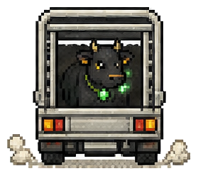 | [diary_shipping.png](sprites/diary_shipping.png) | diary_shipping | 279 × 248 |
| 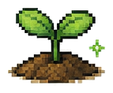 | [diary_sprout.png](sprites/diary_sprout.png) | diary_sprout | 143 × 118 |
| 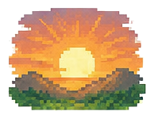 | [diary_sunrise.png](sprites/diary_sunrise.png) | diary_sunrise | 194 × 150 |
| 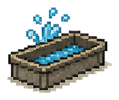 | [diary_water_trough.png](sprites/diary_water_trough.png) | diary_water_trough | 171 × 143 |
| 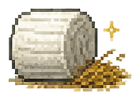 | [diary_wrap_bale.png](sprites/diary_wrap_bale.png) | diary_wrap_bale | 177 × 126 |
| 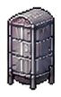 | [dryer.png](sprites/dryer.png) | 乾燥機 | 68 × 108 |
| 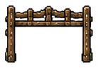 | [farm_gate.png](sprites/farm_gate.png) | 牧場ゲート | 139 × 97 |
|  | [feed_bag.png](sprites/feed_bag.png) | 飼料袋 | 55 × 60 |
| 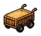 | [feed_cart.png](sprites/feed_cart.png) | 飼料運搬車 | 81 × 73 |
| 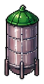 | [feed_tank.png](sprites/feed_tank.png) | 飼料タンク | 72 × 137 |
|  | [fence.png](sprites/fence.png) | fence | 161 × 76 |
|  | [fertilizer_bag.png](sprites/fertilizer_bag.png) | 肥料袋 | 53 × 55 |
| 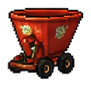 | [fertilizer_spreader.png](sprites/fertilizer_spreader.png) | ブロードキャスター | 91 × 86 |
|  | [flower_bed.png](sprites/flower_bed.png) | 花だん | 72 × 63 |
| 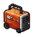 | [generator.png](sprites/generator.png) | 発電機 | 69 × 75 |
|  | [goat_shed.png](sprites/goat_shed.png) | ヤギ小屋 | 90 × 84 |
|  | [greenhouse.png](sprites/greenhouse.png) | ビニールハウス | 122 × 125 |
|  | [gyusha_large.png](sprites/gyusha_large.png) | gyusha_large | 188 × 160 |
|  | [gyusha_small.png](sprites/gyusha_small.png) | gyusha_small | 124 × 125 |
|  | [hay_roll.png](sprites/hay_roll.png) | 牧草ロール | 62 × 56 |
|  | [hoe.png](sprites/hoe.png) | くわ | 61 × 75 |
|  | [icon_event.png](sprites/icon_event.png) | icon_event | 70 × 68 |
|  | [icon_kirakira.png](sprites/icon_kirakira.png) | icon_kirakira | 60 × 61 |
|  | [icon_mahou_tsubu.png](sprites/icon_mahou_tsubu.png) | icon_mahou_tsubu | 55 × 72 |
|  | [icon_mahou.png](sprites/icon_mahou.png) | icon_mahou | 52 × 69 |
|  | [icon_okane.png](sprites/icon_okane.png) | icon_okane | 60 × 62 |
|  | [icon_taicho.png](sprites/icon_taicho.png) | icon_taicho | 60 × 59 |
|  | [icon_wrap_wara.png](sprites/icon_wrap_wara.png) | icon_wrap_wara | 37 × 36 |
|  | [ido.png](sprites/ido.png) | ido | 86 × 124 |
|  | [kanban.png](sprites/kanban.png) | kanban | 100 × 100 |
|  | [kansoroll.png](sprites/kansoroll.png) | kansoroll | 96 × 90 |
|  | [keijiban.png](sprites/keijiban.png) | keijiban | 117 × 102 |
|  | [keitora.png](sprites/keitora.png) | keitora | 135 × 101 |
|  | [kibako.png](sprites/kibako.png) | kibako | 93 × 91 |
|  | [kusamura.png](sprites/kusamura.png) | kusamura | 86 × 74 |
|  | [lamp.png](sprites/lamp.png) | lamp | 51 × 135 |
|  | [livestock_truck_rear.png](sprites/livestock_truck_rear.png) | 家畜運搬車（後ろ） | 132 × 104 |
|  | [log_pile.png](sprites/log_pile.png) | 丸太の山 | 63 × 51 |
|  | [lumber_bundle.png](sprites/lumber_bundle.png) | 木材の束 | 95 × 51 |
|  | [marker_destination.png](sprites/marker_destination.png) | marker_destination | 59 × 55 |
|  | [marker_facility.png](sprites/marker_facility.png) | marker_facility | 56 × 79 |
|  | [masekitank.png](sprites/masekitank.png) | masekitank | 77 × 127 |
|  | [menu_board.png](sprites/menu_board.png) | 農板メニュー | 51 × 70 |
|  | [milk_stand.png](sprites/milk_stand.png) | 牛乳販売箱 | 62 × 59 |
|  | [milking_shed.png](sprites/milking_shed.png) | 搾乳小屋 | 147 × 121 |
|  | [mizunomiba.png](sprites/mizunomiba.png) | mizunomiba | 108 × 69 |
|  | [mizutank.png](sprites/mizutank.png) | mizutank | 79 × 102 |
|  | [mower.png](sprites/mower.png) | 草刈り機 | 98 × 93 |
|  | [nails_bolts.png](sprites/nails_bolts.png) | 釘・ボルト | 45 × 40 |
|  | [npc_boy.png](sprites/npc_boy.png) | 男の子 | 50 × 74 |
|  | [npc_farm_worker.png](sprites/npc_farm_worker.png) | 農作業の人 | 49 × 73 |
|  | [npc_feed_dealer.png](sprites/npc_feed_dealer.png) | 飼料屋さん | 48 × 73 |
|  | [npc_girl.png](sprites/npc_girl.png) | 女の子 | 58 × 74 |
|  | [npc_grandma.png](sprites/npc_grandma.png) | おばあさん | 48 × 69 |
|  | [npc_grandpa.png](sprites/npc_grandpa.png) | おじいさん | 49 × 69 |
|  | [npc_market_staff.png](sprites/npc_market_staff.png) | 市場の人 | 48 × 69 |
|  | [npc_vet.png](sprites/npc_vet.png) | 獣医さん | 49 × 73 |
|  | [pitchfork.png](sprites/pitchfork.png) | フォーク | 50 × 72 |
|  | [poster_board.png](sprites/poster_board.png) | ポスター掲示板 | 85 × 68 |
|  | [pump_house.png](sprites/pump_house.png) | ポンプ小屋 | 76 × 80 |
|  | [rabbit_hutch.png](sprites/rabbit_hutch.png) | うさぎ小屋 | 64 × 78 |
|  | [rice_planter.png](sprites/rice_planter.png) | 田植え機 | 106 × 83 |
|  | [rock.png](sprites/rock.png) | rock | 72 × 62 |
|  | [rope.png](sprites/rope.png) | ロープ | 57 × 57 |
|  | [round_baler.png](sprites/round_baler.png) | ロールベーラー | 90 × 80 |
|  | [sagyogoya.png](sprites/sagyogoya.png) | sagyogoya | 121 × 133 |
|  | [scale.png](sprites/scale.png) | 体重計 | 64 × 75 |
|  | [scarecrow.png](sprites/scarecrow.png) | かかし | 64 × 79 |
|  | [seed_storage.png](sprites/seed_storage.png) | 種子貯蔵庫 | 87 × 84 |
|  | [shipping_truck_away_1.png](sprites/shipping_truck_away_1.png) | 出荷トラック（遠ざかる1） | 120 × 104 |
|  | [shipping_truck_away_2.png](sprites/shipping_truck_away_2.png) | 出荷トラック（遠ざかる2） | 96 × 104 |
|  | [shiryo_mixer.png](sprites/shiryo_mixer.png) | shiryo_mixer | 124 × 112 |
|  | [shiryoko.png](sprites/shiryoko.png) | shiryoko | 164 × 145 |
|  | [shovel.png](sprites/shovel.png) | シャベル | 50 × 72 |
|  | [sickle.png](sprites/sickle.png) | 鎌 | 59 × 67 |
|  | [sign_guide.png](sprites/sign_guide.png) | 案内板 | 57 × 61 |
|  | [sign_standing.png](sprites/sign_standing.png) | 立て看板 | 62 × 62 |
|  | [sign_warning.png](sprites/sign_warning.png) | 注意看板 | 68 × 63 |
|  | [silo.png](sprites/silo.png) | silo | 88 × 177 |
|  | [small_windmill.png](sprites/small_windmill.png) | 小型風車 | 60 × 100 |
|  | [solar_panel.png](sprites/solar_panel.png) | ソーラーパネル | 80 × 58 |
|  | [steel_plate.png](sprites/steel_plate.png) | 鉄板 | 60 × 48 |
|  | [taihisha.png](sprites/taihisha.png) | taihisha | 161 × 108 |
|  | [tile_bokujo_michi.png](sprites/tile_bokujo_michi.png) | tile_bokujo_michi | 109 × 109 |
|  | [tile_doro.png](sprites/tile_doro.png) | tile_doro | 111 × 109 |
|  | [tile_hatake.png](sprites/tile_hatake.png) | tile_hatake | 111 × 109 |
|  | [tile_ishidatami.png](sprites/tile_ishidatami.png) | tile_ishidatami | 109 × 109 |
|  | [tile_kusa_nagame.png](sprites/tile_kusa_nagame.png) | tile_kusa_nagame | 110 × 109 |
|  | [tile_kusachi.png](sprites/tile_kusachi.png) | tile_kusachi | 111 × 105 |
|  | [tile_saku_no_naka.png](sprites/tile_saku_no_naka.png) | tile_saku_no_naka | 111 × 111 |
|  | [tile_tochi.png](sprites/tile_tochi.png) | tile_tochi | 109 × 105 |
|  | [tractor.png](sprites/tractor.png) | tractor | 126 × 113 |
|  | [tree_large.png](sprites/tree_large.png) | tree_large | 150 × 120 |
|  | [tree_small.png](sprites/tree_small.png) | tree_small | 78 × 100 |
|  | [tree_stump.png](sprites/tree_stump.png) | 切り株 | 73 × 66 |
|  | [ui_button_example.png](sprites/ui_button_example.png) | ui_button_example | 128 × 61 |
|  | [ui_menu_panel.png](sprites/ui_menu_panel.png) | ui_menu_panel | 160 × 100 |
|  | [ui_message_frame.png](sprites/ui_message_frame.png) | ui_message_frame | 167 × 93 |
|  | [warehouse.png](sprites/warehouse.png) | 倉庫 | 130 × 121 |
|  | [water_cup.png](sprites/water_cup.png) | ウォーターカップ | 42 × 73 |
|  | [water_tank.png](sprites/water_tank.png) | 貯水タンク | 59 × 89 |
|  | [wheel_loader.png](sprites/wheel_loader.png) | wheel_loader | 177 × 111 |
|  | [wheelbarrow.png](sprites/wheelbarrow.png) | 一輪車 | 77 × 61 |
|  | [wildflowers.png](sprites/wildflowers.png) | 野草 | 70 × 67 |
|  | [workshop.png](sprites/workshop.png) | 工房 | 158 × 135 |
|  | [wrap_wara.png](sprites/wrap_wara.png) | wrap_wara | 198 × 121 |
